```{r setup, include=FALSE, eval=T}
knitr::opts_chunk$set(echo = T,
                     warning = FALSE)

```

# {.tabset  .tabset-fade}

## The data

<br>

The data file is **split.sav** which we first met in lab class 4, with 24 variables and 115 cases. The items are listed under "Splitting index".  

Your aim today is to fit a three factor confirmatory analysis model to these data using Amos. The next tab contains a detailed walkthrough for how to do this.

If you get stuck at any step, you should alert (i.e., wave enthusiastically at) one of us after having a look at the walkthrough videos. The walkthrough videos are hidden under the walkthrough arrows if you're on a compatible browser - we've tested them on Chrome and Firefox, and they do not work on Edge or Internet Explorer.

<br>
For example:

<br>
<details><summary> Walkthrough </summary>
<p>

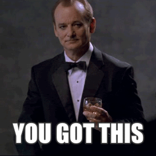

Most of the walkthrough videos will be more helpful than this example.

</p>
</details>

<br>

#### The quick summary of what you will do today is: 

• Open Amos. 

• Draw your model. 

• Name your factors.

• Run your model.

• Interpret the model output. 

• Add correlations between the factors and run the correlated model, and compare fits across models.

<br>

<br>

## How to draw with Amos

### 1. Open Amos 

Amos provides about eighty drawing and modelling operations. Whatever we want to do, Amos drawing begins with the same screen:

```{r pressure, echo=FALSE, out.width = '70%'}
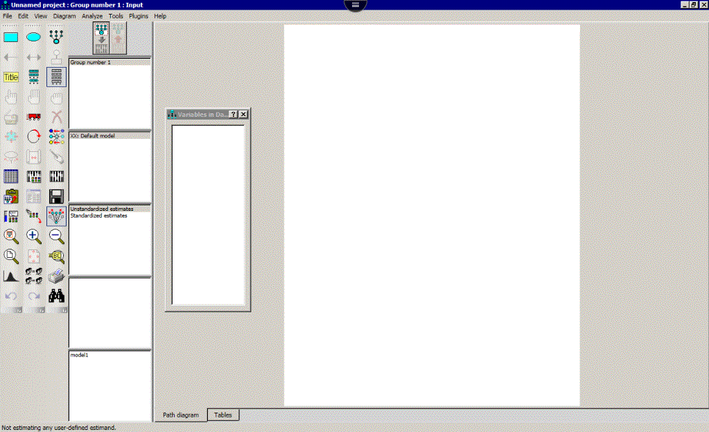
```

If there is already an image there, you can start afresh by selecting *New* from the pull down menu at the top under ‘File’.

The tools used in Amos are arranged on the left hand side of the screen. Most buttons are toggle based - click on and click off. The function of each button appears in a bar as you hover your mouse over it.

#### SEM tools

<br>

 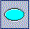 Use this tool to draw an unobserved variable as an ellipse. 

 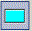 Select this tool to draw observed variables as a rectangle. 

 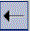 Use this tool to draw factor loadings or regression lines with a single headed arrow. 

 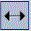 Use this tool to allow variables to be correlated using a curved double headed arrow. 

 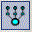 Use this to create a factor structure from an ellipse (representing the factor).


For some unknown reason it can be quite difficult to get Amos to recognize a factor structure that you have created piece by piece with rectangles, arrows and ellipses. Amos much prefers factors drawn with this last special button that looks like some sort of upside down alien.

<br>

#### To edit your diagram: 
<br>

 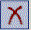 Select this tool and then click on an object (a line, curve, rectangle or ellipse) to delete it.
 
  Select this and then click on an object to select it. 

  Click on this to select all objects.

  Click on this to de-select all selected objects.
 
 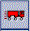 Click on this to move a selected object or group of objects.
 
 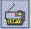 Select this and then click, drag and drop an object to duplicate it in the new position.

 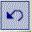 Click on this to undo the mistake you just made.
 
 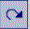 Click on this to redo an undone action. 
 
 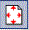 Fits the diagram to the page
 

<br>

<br>

## Amos walkthrough


### 2. Draw a single factor with 8 observed items

We're going to take advantage of the fact that there are three factors with 8 items each and the fact that Amos has a copy function. 

First, draw one factor with eight items near the top of the page using the  button. Click once for the ellipse (unobserved variable). Click 8 times on the ellipse to draw each observed variable (represented by rectangles) and their associated error terms (circles). 

Note that the upside-down alien button () automatically adds an unstandardized loading of 1 between each error term and the observed variable, and fixes the loading of the factor on the first observed variable to one.  

Second, turn your diagram so the items are to the left or right of the factor using the 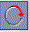 button. This has no mathematical implications but does help your diagram look pretty.


<details><summary>Walkthrough</summary>
<p>


</p>
</details>

<br>

### 3. Copy your factor structure twice. 

The next step is to copy your factor structure twice. Copy the factor by selecting all objects (with the high-five button:  ), switching to the the copy tool (the photocopier button: ), clicking on the ellipse and dragging a copy down. Click and drag from the second ellipse to produce another copy.


<details><summary>Walkthrough</summary>
<p>

 

</p>
</details>

<br>

### 4. Define each observed variable 

Next, you need to define each observed variable (i.e., each rectangle). To do so, you can give each a name that corresponds to a variable in you dataset by double clicking on each rectangle and never making a spelling error, or by clicking and dragging from a list. In either case, you first need to make sure that you tell Amos where the active dataset is.

To do so, click the "Select data file" button (the spreadsheet button: 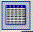), click *File Name*, navigate to your data file (**split.sav**), and open it.

From there, you can click on the list variables in data set button (the stacked pizza boxes button: ), and click and drag each variable over to the appropriate rectangle. Make sure you put the right variables with each factor. If you're unsure which variables should go with which factor, take a look at the Splitting index tab.


<details><summary>Walkthrough</summary>
<p>


</p>
</details>

<br>

### 5. Name your factors and error terms.

Now we just need to name our factors and error terms. First, you can name your factors whatever you want (as long as all of the names do not appear as variable names in your data file), although it makes sense to name them something that will meaningfully identify the unobserved variable you are modelling. Then you need to name the error terms - thankfully you can do this quickly by going to the *plugins* menu and selecting *Name unobserved variables*.

*At this point every rectangle should have a variable name from your data file and no ellipse (or circle) must have a variable name from your data file.*


<details><summary>Walkthrough</summary>
<p>


</p>
</details>


<br>

### 6. Add a figure caption to display statistics of interest

Now you can use the  button to add in a figure caption to display some of Amos' output on the screen when you run the model. You do this using the "\\" symbol which Amos recognizes, making it display the statistic designated by whatever word follows it. 

Try copying and pasting the following into the figure caption box (you might want to bump the font size down to something like 16 as well): 

```{}

Chisquare = \cmin
df = \df
p = \p
CFI = \cfi
RMSEA = \rmsea

```

This will, in the above order, make Amos display the $\chi^2$ statistic, the degrees of freedom, p value, CFI and RMSEA for your model when you run it. Most of the keywords are self explanatory [cmin for chi square is a little cryptic]. Another useful index of fit, the comparative fit index or CFI is represented by \\cfi. 

<details><summary>Walkthrough</summary>
<p>


</p>
</details>

<br>


### 7. Run your model

In order to run the model, you'll first need to **save your file**, and set up some analysis options. Make sure to save your file in a writable directory (e.g., in "Documents/Lab5", not in the SPSS or Amos program directory). 

Click the 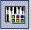 button to access the options. 

<br>
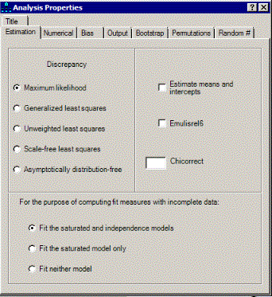

If you had missing data you would have to click on the ‘Estimate means and intercepts’ button (or use more sophisticated methods of data imputation), but today you can leave this section alone.

Options for printing and so forth are found on the ‘Output’ tab. Normally you would choose standardized estimates (as you should today). In Amos by default, the factor loadings are unstandardised regression weights and the labels on the curved double headed arrows covariances. Standardized estimates restores the more familiar look of standardised regression weights and correlations.

• Squared multiple correlations give us our communality estimates

• Residual moments gives us the residuals in the covariance and correlation matrix. This can be helpful if we want to fiddle with our model.

• Select "modification indices" too, which allows us to see which changes would improve model fit the most (beware ad hoc changes to improve model fit at the cost of overfitting). 

• Tests for normality and outliers can be helpful too!

<br>

Now your output options tab should look like this: 

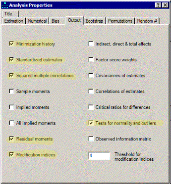


Finally, go to the plugins drop down menu and select 
the standardized RMR menu item to get SRMR output when you run your model. 

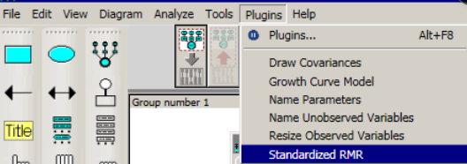

<br>

Now you're ready to run your analysis with the abacus button 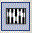. *You will see a warning message, do not worry!*

<br>
One you've successfully run your model, you'll have to go to the slightly mysterious output button to see your model estimates:

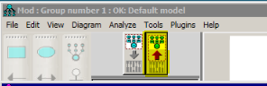

Finally, you might want to get standardized output instead of unstandardized output by selecting the "standardized output" text, in the third white box down on the left hand side, next to the toolbox, in order to get standardized output instead of output in the units of whatever  observed variable happened to be fixed for each factor.

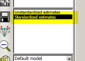

<br>

<details><summary>Walkthrough</summary>
<p>


</p>
</details>

<br>

### 8. Viewing the model output

You can click the text output using the  button, which gives you the full text output. Your output should look like this:

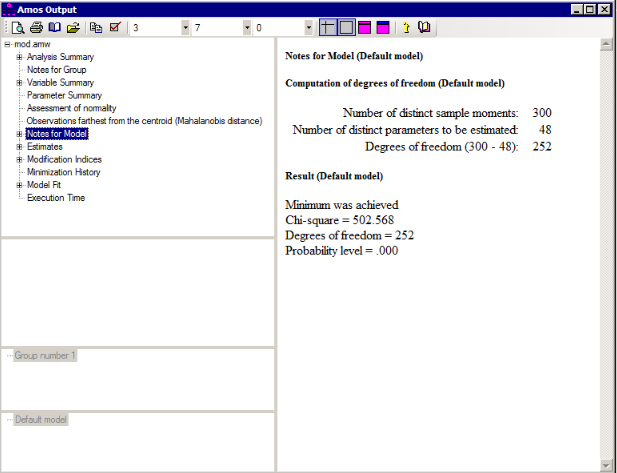

If any of those numbers are different, you might need to check with one of us! 


## Interpreting the output

<br>

Before attempting these questions, take a look through the model output and try to understand what's going on! Discuss with your peers and ask the tutors any questions you might have. These questions are only here to give you some guidance in what sorts of questions it will be worth asking, and to give you some guidance on what are the first things to inspect after running a model. 

<br>

#### Questions

1) Which variables have the most variance explained by each factor?

<br>

**Take a look at the assessment of normality output.**

<details><summary>How to find the assessment of normality tab</summary>
<p>

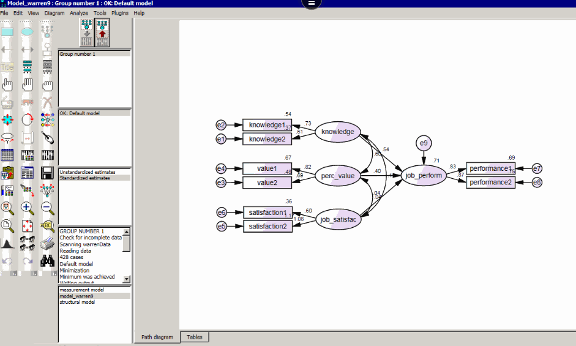

</p>
</details>

<br>

2) Are there any worrying signs of multivariate non-normality?

<br> 

**Navigate to the model fit page in the Amos output window. Take a look at the fit indices that we discussed in class.**

<details><summary>How to find model fit estimates</summary>
<p>

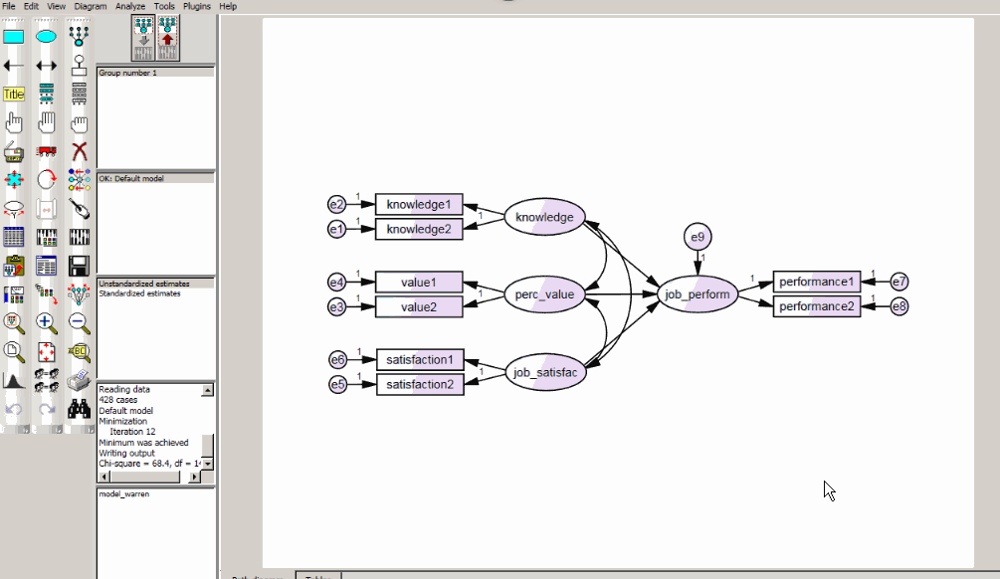

</p>
</details>

<br>

3) Do small or large chi square statistics indicate good fit? Does our chi square value indicate good fit? 

4) Do small or large RMSEAs indicate good fit? How about our RMSEA?

<br>

**Finally, add correlations among the factors and rerun the model. Make sure to keep a record of the old output (e.g., take a screen shot).**

5) Does model fit improve? 

6) Does it make theoretical sense to correlate these factors?

7) Do any of the factor loadings noticeably change? 


##  Splitting index

SPLITTING INDEX.
(S) = splitting of self images subscale
(F) = splitting of family images subscale
(O) = splitting of others’ images subscale
[-] = item is reverse scored.

1. I feel different about myself when I am with different people. (S)
2. My mother has faults, but I have never doubted her love for me. (F)[-]
3. Being able to keep friends is one of my strong points. (0)[-]
4. My parents always took care of my needs. (F)[-]
5. My feelings about myself shift dramatically. (S)
6. It is impossible to love my parents all the time. (F)
7. The different parts of my personality are difficult to put together. (S)
8. My feelings about my mother change from day to day. (F)
9. My parents did the best they could for me. (F)[-]
10. I have doubts about my closest friends. (0)
11. Sometimes I am not sure who I am. (S)
12. My feelings about myself are very powerful, but they can change from one
moment to the next. (S)
13. My friendships are almost always satisfying. (0)[-]
14. My feelings about myself do not change easily. (S)[-]
15. I have had many long-lasting friendships. (0)[-]
16. I sometimes feel "pulled apart" by my feelings about myself. (S)[-]
17. My relationship with my family is solid. (F)[-]
18. My feelings toward those close to me remain constant. (0)[-]
19. I have always been aware that my close friends really cared for me. (0)[-]
20. My opinions of my friends rarely change. (0)[-]
21. I almost always feel good about those close to me. (0)[-]
22. I have extremely mixed feelings about my mother. (F)
23. My family was often hurtful to me. (F)
24. Who I am depends on how I am feeling. (S)

Gould, J.R., Prentice, N.M., and Ainslie, R.C. (1996) The splitting index: Construction of a scale measuring the defense mechanism of splitting. Journal of Personality Assessment, 66, 414 - 430.


## Question answers

Please attempt the questions on your own before checking your answers here. 

**1) Which variables have the most variance exaplined by each factor?**

To answer this question you can look at the standardized regression weights or the squared multiple correlations either on your diagram or in the output window. 

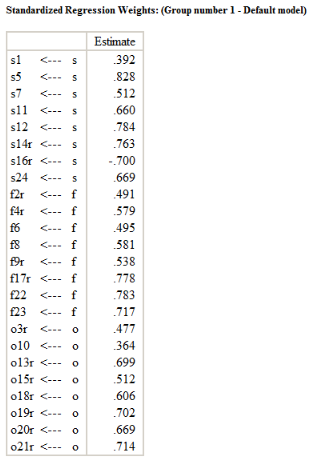

For the "S" factor, the strongest loading is onto S5, for the "f" factor, the strongest loading is onto f22, and for the "o" factor, the strongest loading is onto o21.

**2) Take a look at the assessment of normality output. Are there any worrying signs of multivarite non-normality?**

Looking at the "assessment of normality" tab in the output window, there are signs of strong non-normality (specifically, strong multivariate kurtosis). Perhaps using bootstrap methods would be a good idea for the purposes of estimating standard errors / significance testing (more on this later in semester).

<details><summary>How to find the assessment of normality tab</summary>
<p>


</p>
</details>

<br>

<br>

**3) Do small or large chi square statistics indicate good fit? Does our chi square value indicate good fit?**

<br>

<details><summary>How to find model fit estimates</summary>
<p>


</p>
</details>

<br>


Smaller chi square values indicate less discrepancy between the model variance covariance matrix and the data's. In this case, we have a very large chi square value relative to our degrees of freedom, which indicates we have poor fit.


**4) Do small or large RMSEAs indicate good fit? How about our RMSEA?**

RMSEA is another "badness of fit" statistic, with larger values indicating more badness of fit. It acts to ‘reward’ models analysed with larger samples, and models with more degrees of freedom. Our RMSEA isn't great at .09, but it is the least bad of all of our indicators.

#### After adding correlations among factors: 

**5) Does model fit improve?** 

Yes, moderately, with the SRMR going to .10, RMSEA going down slightly (still .09 after rounding), and the CFI going down to .71, and the Chi Square statistic going to 476.55.

**6) Does it make theoretical sense to correlate these factors?**

This one you'll have to think about!

**7) Do any of the factor loadings noticably change?** 

Not really! Only minor changes. 

<br>

