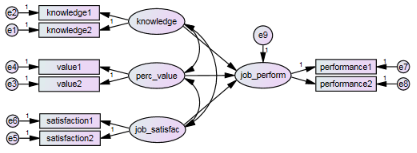
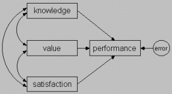

```{r setup, include=FALSE}
knitr::opts_chunk$set(echo = FALSE)
library(knitr); library(xtable); library(tidyverse); library(kableExtra)
```


# {.tabset  .tabset-fade}

## The data

<br>

This tutorial adapts two chapters from the Amos User’s Guide (Arbuckle, 2011). The chapters are on the LMS. In this lab, we will use Amos but not an SPSS dataset. In this case, we will use an excel spreadsheet, illustrating that Amos can be used entirely independently of SPSS. This dataset includes 428 cases, each a manager of a small manufacturing business, and each with recorded observations on 9 variables. It is worth noting that we could perform this analysis solely on the basis of the variance covariance matrix, although here we have the full dataset. 

Each manager took two tests of their domain specific knowledge (knowledge1 and knowledge2), two tests that assessed the perceived value of their work (i.e., did they think their job is important, value1 and value2), two tests of their job satisfaction (satisfaction1 and satisfaction2). Finally, two objective measures of their job performance were taken, measures of how productive they were (normalized against their area of business performance1) and the quality of their management experience (performance2). In addition, there is a variable that gives the (standardized) amount of training each person has received.

### Today's analysis

Unlike yesterday, we're going to give you an Amos file with the model already constructed. Your main job today is to understand the output and assess the model, as opposed to understanding how to build one in Amos. 

As always, don't worry if some of these questions are difficult! They're designed to make you stretch -- we expect everyone to have to make use of the lecture slides / your notes to even begin to answer many of them! 

At some point we're going to interrupt your work to bring a few of y'all up to the board to turn a theory into a SEM path diagram.

<br>

#### Table 1. Descriptives for each variable included in this dataset. 

```{r echo = F}
Test <- c("performance", "knowledge", "value", "satisfaction")
Explanation <- c('A 24-item test of performance related to “planning, organization, controlling, coordinating, and directing”',  'A 26-item test of knowledge of “economic phases of management directed toward profit-making...and product knowledge”.', 'A 30-item test of “tendency to rationally evaluate means to an economic end”', "An 11-item test of “gratification obtained...from performing the managerial role”")
# knitr::kable(data.frame(Test, Explanation))

kable(psych::describe(readxl::read_xls("warrenData.xls"))[-c(1,2,6,7,13)], col.names = c("Mean", "SD", "Median", "Minimum value", "Maximum Value", "Range", "Skew", "Kurtosis"), digits = 2)%>%
  kable_styling("striped", full_width = F)  %>%
  row_spec(0, bold = FALSE, color = "black") %>% column_spec(1, bold = T, color = "black")

```

<br>

#### Table 2. Correlation table for all variables included in this dataset.

```{r}
dat <- readxl::read_xls("warrenData.xls")

cordat <- round(cor(dat),2)
cordat[upper.tri(cor(dat))] <- ""
 
kable(cordat) %>%
  kable_styling("striped", full_width = F)  %>%
  row_spec(0, bold = FALSE, color = "black") %>% column_spec(1, bold = T, color = "black")
```


<br>


<br>


## Today's model 

<br>


The model we're going to be working with can be opened in Amos (open Amos, go to file -> open, find "model_warren.amw" and click open). You should find a model that looks something like this: 

<br>

 

<br>


The model we're going to be using can be separated into two familiar parts, the measurement model and the structural model. 


### The structural model 

<br>


<br>

The structural model describes how we think our theoretical constructs relate to each other.


#### Question 1

1) **Describe the theorised relationship between variables pictured as part of the structural models. How do the theorised constructs relate to one another?**

<br>

### The measurement model

<br>


<br>

The measurement model on the other hand, describes how the measures in our dataset relate to the constructs of interest. 

#### Questions 2 - 3 

<br>

2) **Can you describe the measurement model in words?**

<br>

3) **Why don't we just create a sum score of each pair of measures and use the following model instead?**


<br>



<br>


<br>

## Running the model

In order to run the model, you need to select the dataset and set up some options as we did last week. 

Select the appropriate dataset by clicking on the select dataset button () and navigating to "warrenData.xls". 

Click the  button to access the output options. 

<br>


If you had missing data you would have to click on the ‘Estimate means and intercepts’ button (or use more sophisticated methods of data imputation), but today you can leave this section alone.

Options for printing and so forth are found on the ‘Output’ tab. Normally you would choose standardized estimates (as you should today). In Amos by default, the factor loadings are unstandardised regression weights and the labels on the curved double headed arrows covariances. Standardized estimates restores the more familiar look of standardised regression weights and correlations.

• Squared multiple correlations give us our communality estimates

• Residual moments gives us the residuals in the covariance and correlation matrix. This can be helpful if we want to fiddle with our model.

• Select "modification indices" too, which allows us to see which changes would improve model fit the most (beware ad hoc changes to improve model fit at the cost of overfitting). 

• Tests for normality and outliers can be helpful too!

<br>

Now your output tab should look like this: 


Finally, go to the plugins drop down menu and select 
the standardized RMR menu item to get SRMR output when you run your model. 


<br>

Now you're ready to run your analysis with the abacus button . *This time if you see a warning message, you should probably worry!*

<br>
One you've successfully run your model, remember that you'll have to go to the output button to see your model estimates:


Finally, you might want to get standardized output instead of unstandardized output by selecting the "standardized output" text, in the third white box down on the left hand side, next to the toolbox, in order to get standardized output instead of output in the units of whatever  observed variable happened to be fixed for each factor.


<br>

<details><summary>Walkthrough</summary>
<p>


</p>
</details>

<br>

### Viewing the model output

You can click the text output using the  button, which gives you the full text output. Your output should look like this:


If any of those numbers are different, you might need to check with one of us! 

<br>

## Interpreting the model 

Again, these questions are here to provide some guidance on what sorts of things you should be thinking about when using these techniques. Do not worry if you do not complete them, the main thing is to think and discuss with your peers what the model suggests and how well it fits.

In this section we'll go through two important steps in structural equation modeling: 

A) Checking modeling assumptions

B) Assessing model fit

### A) Checking normality assumptions 

Violations of multivariate normality can cause our models to be incorrectly rejected or make our standard errors spuriously small (i.e., our model may think our estimates are much more precise than they actually are). Take a look at the assessment of normality and Mahalanobis distance tabs of the Amos output window to assess whether there are any signs of non-normality. 

#### Questions about normality

4) **Are there any signs of multivariate non-nomality? Specifically look at the multivariate kurtosis value and critial ratio, as well as the p1 and p2 values under the "Observations farthest from the centroid (Mahalanobis distance)" tab.** 

<br>

<details><summary>How to find the assessment of normality tab</summary>
<p>


</p>
</details>

<br>

5) **What statistical approach could we take in Amos if we saw severe violations of multivariate normality?** 

6) **Use these methods to test (a) overall fit, and (b) to find confidence intervals around our regression weights models (you will have to estimate your model twice, look at the slides for advice on how to do this). Are there any differences in interpretation that would result? Why or why not might this be the case?** 

### B) Assessing fit 

Navigate to the model fit page in the Amos output window. Taking a quick look at the fit indices and try to answer the following questions (take a look at the slides to help yourself out of course!):


<br>

<details><summary>How to find model fit estimates</summary>
<p>


</p>
</details>

<br>

7) **Do small or large chi square statistics indicate good fit? Does our chi square value indicate good fit?**

8) **Do small or large SRMR values indicate good fit? How about our SRMR?**

9)  **Do small or large CFIs indicate good fit? How about our CFI?** 

10) **Do small or large RMSEAs indicate good fit? How about our RMSEA?**

<br>
<br>


## Question answers

<br>

*Make sure to attempt the questions before checking your answers here! *

<br>

1) **How do these theorical constructs relate to one another? Does this model make sense to you? Are there other ways this model could be constructed?**

This model says that knowledge, perceived value of people's jobs, and their job satisfaction are all correlated, and that they all predict job performance.


2) **Can you describe the measurement model in words?**

Each theoretical construct predicts the score of its two associated measures. This implies that each person's true, unobserved construct (e.g., their true level of job satisfaction), causes their score on a given measure (e.g., *satisfaction1*). However, this measurement model also acknowledges that there are additional sources of error that explain some of the variability in the measured scores (e.g., *e6*). 

3) **Why don't we just create a sum score of each pair of measures and 
use that instead?**

Because that would implicitly assume that we've measured the theoretical constructs without measurement error. 

4) **Are there any signs of multivariate non-nomality? Specifically look at the multivariate kurtosis value and critial ratio, as well as the p1 and p2 values under the "Observations farthest from the centroid (Mahalanobis distance)" tab.** 


<details><summary>How to find the assessment of normality tab</summary>
<p>


</p>
</details>

<br>

There are no worrying signs of non-normality. The kurtosis value is low, and its critical ratio (the Kurtosis value divided by its standard error) is far from worrying (at .113). Looking at the tab below ("Observations farthest from the centroid (Mahalanobis distance)"), there is no worrying sign of abnormality. 

p1 describes the probability of any value being as far or further from the centroid given multivariate normality. The p1 value for the highest Mahalanobis distance (.001) is not worrying given the size of our dataset. Small values here are perfectly normal. 

p2 gives the probability that the Mahalanobis distance in this rank order exceeds the observed value. That means that the first p2 value listed gives the probability of the highest  Mahalanobis distance being further out that the observed value. The second row's p2 value gives the probability that the second largest Mahalanobis distance is further from the centroid than that which was observed. The third row [etc]. We don't want to see low values here. We have no reason to worry in our dataset, as for example, there was a reasonably high probability that the highest Mahalanobis distance was as far out as the observed distance given multivariate normality. 

5) **What statistical approach could we take in Amos if we saw severe violations of multivariate normality?** 

Bootstrapping

6) **Use these methods to test (a) overall fit, and (b) to find confidence intervals around our regression weights models (you will have to estiamte your model twice, look at the slides for advice on how to do this). Are there any differences in interpretation that would result? Why or why not might this be the case?** 

To test overall fit, we can use the Bollen-Stein bootstrap method.

<details><summary>How to use and view the Bollen-Stein bootstrap</summary>
<p>


</p>
</details>

<br>

The Bollen-Stein bootstrap is described in the Amos documentation:  
"The Bollen-Stine bootstrap process involves the transformation of the data to a data set for which the null hypothesis (that the default model fits the data) is true. [...] Each bootstrap sample is sampled from this transformed data and a chi-square is computed for the fit of that bootstrapped data to the model. These chi-squares [...] are compared internally to the chi-square that was computed for the observed data fit to the model. [...] The proportion of times that the model 'fit worse or failed to fit', i.e. the number of times that the model chi-square for the bootstrapped sample exceeded the chi-square for the observed data, is the Bollen-Stine bootstrap p value."

Using the Bollen-Stein bootstrap to test overall fit, we see that the Bollen-Stein bootstrap agrees with the parametric (distribution assuming) methods used before - the probability of getting the observed variance covariance matrix assuming that our model is correct is very low (when we ran this model, the Bollen-Stein model fit better in every single bootstrap).

In order to test whether the standard errors (i.e., the standard deviation of the sampling distribution, or alternatively a measure of the amount of variability we expect in a value due to sampling variability alone) are well approximated by the normal approximation (and therefore the accompanying p values), we can use the ML bootstrap method. Make sure to bump up the number of Bootstrap samples taken too. Here our data is very much multivariate normal - so the results are all basically identical. 

<details><summary>How to use and view the Bootstrap ML estimated SEs</summary>
<p>


</p>
</details>

<br>

<br>

<details><summary>How to find model fit estimates</summary>
<p>


</p>
</details>

<br>

<br>


7) **Do small or large chi square statistics indicate good fit? Does our chi square value indicate good fit?** 

Smaller chi square values indicate less discrepancy between the model variance covariance matrix and the data's. In this case, we have a fairly large chi square value relative to our degrees of freedom, which indicates we have somewhat poor fit.

8) **Do small or large SRMR values indicate good fit? How about our SRMR?**

The metric of SRMR can be loosely thought of as the averaged difference between the model's correlation matrix and the observed correlation matrix (albeit using an unusual method of averaging, and involving the model and observed variances, see [this post]( https://stats.stackexchange.com/questions/235872/what-is-the-formula-for-standardized-root-mean-residual-srmr-in-the-context-of) for a detailed description by a former tutor of this subject). It ranges between 0 and 1, and smaller values are better. 

0.0418 is quite a good SRMR value 

9)  **Do small or large CFIs indicate good fit? How about our CFI?**

CFI values can be thought of as a ratio of how well your model fits the data compared to how well the null model fits. (The null model allows all the variables in the model to have variation but no correlations / associations between variables).

$CFI = \frac{(\chi^2_{null} - df_{null}) - (\chi^2_{model} - df_{model})}{\chi^2_{null} - df_{null}}$

Where values above 1 are set to 1, and values below 0 are set to equal 0. 

This means CFI values close to 1 are good - your model is greatly out-performing the null model indicating a very good fit. Values close to 0 are quite bad on the other hand. In this case we have a CFI of .954, which is fairly postive. 


10) **Do small or large RMSEAs indicate good fit? How about our RMSEA?**

RMSEA is another "badness of fit" statistic, with larger values indicating more badness of fit. It acts to ‘reward’ models analysed with larger samples, and models with more degrees of freedom. Our RMSEA isn't great at .095, with 90% confidence intervals from .073 to .119, suggesting that we have at best mediocre fit and at worst fairly poor fit. 

<br>

<br>

<br>

