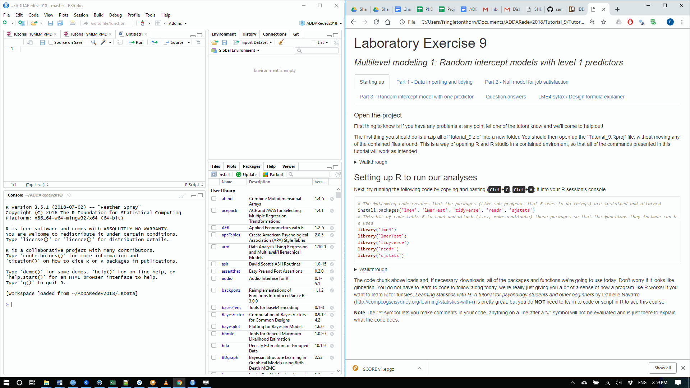

```{r setup, include=FALSE, eval=T}
knitr::opts_chunk$set(echo = T,
                      results = "hide",
                     warning = FALSE)

for(package in c('lme4', 'lmerTest', 'tidyverse', 'foreign', 'readr', 'sjstats', 'sjPlot')) { # start a loop
    if (!require(package, character.only=T, quietly=T)) {
        install.packages(package)
        library(package, character.only=T)
    }
}

```

# {.tabset  .tabset-fade}

## Starting up

#### Open the project

First thing to know is if you have any problems at any point let one of the tutors know and we'll come to help out! *Please make sure that you have opened this document (lab9.html) in Google Chrome. If you do not have tabs up the top of this file, you should reopen it in Google Chrome.*

We're going to be using R and RStudio today. R is a free software environment for statistical analysis, computing and plotting. It runs on most operating systems, including Windows and MacOS. It takes a little getting used to, but is by far the easiest way of running multilevel models. If you want to install it on your own computer, follow the instructions [here](https://courses.edx.org/courses/UTAustinX/UT.7.01x/3T2014/56c5437b88fa43cf828bff5371c6a924/) to download both R and RStudio.

For today, the first thing you should do is **unzip all of "tutorial_9.zip" into a new folder**. You should then open up the "*Tutorial_9.Rproj*" file, **without moving any of the contained files around**. This is a way of opening R and R studio in a contained environment, so that all of the commands presented in this tutorial will work as intended.


<details><summary>Walkthrough</summary>
<p>

</p>
</details>

\n
\n

### Setting up R Studio to run our analyses

Next, try running the following code by copying and pasting (<kbd>Ctrl</kbd>+<kbd>C</kbd>, <kbd>Ctrl</kbd>+<kbd>V</kbd>) it into your R session's console. Take a look at the walkthrough below to see where the console will be in RStudio. 

```{r eval = F}
# The following code ensures that the packages (like sub-programs that R uses to do things) are installed
install.packages(c('lme4', 'lmerTest', 'tidyverse', 'readr', 'sjstats'))
# This bit of code tells R to load and attach (i.e., make avaliable) those packages so that the functions they include can be used
library('lme4')
library('lmerTest')
library('tidyverse')
library('readr')
library('sjstats')
```


<details open><summary>Walkthrough</summary>
<p>

</p>
</details>

\n
\n

The code chunk above  downloads and installs all of the things we're going to use today (i.e., all of the packages and functions we use). Don't worry if it looks like gibberish. You do not have to learn to code to follow along today, we're really just giving you a bit of a sense of how a program like R works! If you want to learn R for funsies, *Learning statistics with R: A tutorial for psychology students and other beginners* by Danielle Navarro  (http://compcogscisydney.org/learning-statistics-with-r) is pretty great, but you do **NOT** need to learn to code or script in R to ace this course.


**Note** The "#" symbol lets you make comments in your code, anything on a line after a "#" symbol will not be evaluated and is just there to explain what the code does.


## Part 1 - Data importing and tidying

#### The data
The data for this week's exercise comes from organizational psychology and derives from that described in Klein et al (2000). The data is in two files, *siop.csv* and *siop_group.csv*.

#### Individual level predictors

The file *siop.csv* contains 750 employee-level observations nested within 50 work-groups. Apart from group ID (grpid), there are seven standardized variables, where a higher score indicates a higher level (e.g., higher pay or more negative leadership behaviours). These data were collected by individual survey of the employees, so measure individual level perceptions.


```{r echo = F}
knitr::kable(data_frame("Variable name" = c("grpid", "jobsat", "cohes", "posaff", "pay", "neglead", "wload", "tasksig"), 
           "Description"  = c("Group ID", "Job satisfaction", "Perceived cohesion", "Positive affect", "Pay", "Perceived Negative leader behaviours", "Perceived workload", "Perceived task significance")))

```

#### Group level predictors
In addition to the group ID file, the file *siop-group.csv* contains one standardized group level variable, physen: physical work environment. This variable measures the work environment of each work-group, with a higher score indicating better working conditions.

### Importing the raw data files

We can read in the data files using the function "read_csv", this opens the data file in RStudio. Copy paste the following code into your R console to read our data. 

```{r message=FALSE, warning=FALSE}
siop <- read_csv("siop.csv")
siop_group <- read_csv("siop_group.csv")
```

<details><summary>Walkthrough</summary>
<p>

</p>
</details>


<details><summary>Optional function explanation</summary>
<p>

In R, a set of characters followed by brackets is a function. For example "round()" is the function that rounds numbers to the nearest number.

The contents of the brackets tell R what to do. So *round(1.123)* will give you "1", as R is rounding 1.123 to the nearest whole number.  *<-* is how we tell R to assign a variable. So, writing *abc <- 1* is like saying to R, store a 1 in the variable "abc". 

You can pass multiple augments to functions by separating them with commas, for example *round(1.123, 2)* rounds 1.123 to two decimal places, i.e., to 1.12.
<br>
<br>
</p>
</details>
<br>

*siop <- read_csv("siop.csv")* tells R to save the output of the function *read_csv("siop.csv")* as *siop* in the workspace (i.e., R's short term memory). You can look up the top right of R studio under "enviroment" to see which objects are currently in the workspace. 


We can **view** the files in Rstudio using the function *View()* (note the capital "V").

Notice we've got one file that is at the individual level (copy and paste the following code into your R session to see the data - it will open as a new "tab" in RStudio)...

```{r display_individual, eval=F}
View(siop)
```

... and one which is at the group level.

```{r display_group, eval=F}
View(siop_group)
```

### Data cleaning

For multilevel modeling, we want to merge these two files together, to disaggregate from the group level to the individual level. 

At the moment we have two files: *siop* and *siop_group*

If we want to merge these two files together, we can use the function *merge()*. This function tells R to merge files together matching rows by a specified column which exists in both data frames. 

For example, if we wanted to merge two files by a hypothetical variable called "Key_Column" we would use the following function:

```{r eval=FALSE}

siop_merged <- merge(siop, siop_group, by = "Key_Column")

```

We want to merge "siop" and "siop_group" by the variable that exists in both datasets and designates the group. Change *"Key_Column"* in the code chunk above to the variable that exists in both data files that identifies the **Group ID**.

#### Merge siop and siop_group by the group variable, so that each individual row of data has a measure of the group level physical environment

<br>

**NOTE:** you will need to change "Key_Column" to the column name that exists in both "siop" and "siop_group", and don't forget to include the question marks around the variable name! 

<details><summary>Hint</summary>  
<p>

*View(siop)* and *View(siop_group)* to see which column names they have in common - this is the variable that you want to merge by.

</p>
</details>

<details><summary>Answer</summary>
<p>

Copy and paste the following into R to merge the two files matching by *grpid*, the name of the group ID column in both "siop" and "siop_group", and save the results as "siop_merged".


```{r include=T}
siop_merged <- merge(siop, siop_group, by = "grpid")
```

</p>
</details>

\n

#### **Make sure you've got siop_merged working before moving on (e.g., *View(siop_merged)*), it should start like this:**

\n

`r knitr::kable(head(siop_merged))`

\n
\n


## Part 2 - Null model for job satisfaction

<br>

In these exercises, we will predict job satisfaction as the dependent variable.

Let's take a look at our data now - remember it's stored as *siop_merged*! 

```{r eval=FALSE, include=TRUE}
View(siop_merged)
```

```{r echo = F}
table <-knitr::kable(head(siop_merged))
```
`r table # note this appears to be necssary because of bugs`

We will start with the simplest multilevel model which allows for workplace effects on Job Satisfaction, but without any explanatory variables. This is the same as a random effects ANOVA.

This ‘null’ model may be written:

$JobSat_{ij} = \gamma_0 + u_{0j} + \epsilon_{ij}$

An overall intercept ($\gamma_0$), a random effect  for groups($u_{0j}$), and an error term for each person in each group ($\epsilon_{ij}$). 

Remember that the subscripts are indexes for person (i) and group (j). So all the above is saying is that person i in group j has a job satisfaction of $JobSat_{ij}$ equal to a constant (the intercept) $\gamma_0$ plus a random effect for group $u_{0j}$ and a residual for person $\epsilon_{ij}$ - i.e., an error term.

In R's design formula syntax this can be written as
```{r}
"jobsat ~ 1 + (1 | grpid)"
```

```{r echo = F}

item <-knitr::kable(data_frame("Terms"=c("jobsat ~","1 +", "(1 | grpid)"), "Meaning"= c(  "job satisfaction is predicted by",
"An intercept parameter which is the same for everyone in the group",
 "a random intercept for each group")))

```

#### Which should be read as:

`r item`

*Note that the error term is assumed by R and we don't have to explicitly include it*

##### We can estimate this model using the *lmer* (Linear Mixed-Effects Models) function 

```{r}
null_model <- lmer("jobsat ~ 1 + (1 | grpid)", data = siop_merged) 
```

We can then get summary information about our model using the *summary* function.

```{r}
summary(null_model)
```

<details><summary>Display model summary output </summary>
<p>
```{r results=T, echo = F}
summary(null_model)
```
</p>
</details>

<br>

This model says that each person's score is the product of their group membership plus random noise (i.e., the residuals). 

It assumes that the residuals are normally distrubited around a mean of zero, and we estimate the variance of the residuals, here `r round(as.data.frame(VarCorr(null_model))[2,4],3)`).

It assumes that the group means are normally distributed around the overall intercept (here estimated as `r round(fixef(null_model)[[1]], 2)`), and again the thing which we actually estimate is the variance of the distribution of group means (i.e., the variance of the group level intercepts), here `r round(as.data.frame(VarCorr(null_model))[1,4],3)`.

To visualize this see the plot below, which shows job satisfaction by group ID, with blue dots for the best linear unbiased prediction of each group's true mean (i.e., the group intercepts). 


<details><summary> Figure 1 </summary>
<p>

```{r echo = F}

qplot(x = siop_merged$jobsat, y = as.factor(siop_merged$grpid), ylab = "Group ID",
      xlab = "Job satisfaction") + 
  geom_point(aes(x = unlist(ranef(null_model)), y = as.factor(1:50)), 
             colour = "blue", size = 3, alpha = .7) + theme_sjplot()

```

Figure 1. job satisfaction by group ID, blue points show the best linear unbiased predictor of each group's true mean. 

</p>
</details>

<br>

##### **Question 1**
How large is the intercept of the model? Looking at the dependent variable (its mean, range and standard deviation), does it look like this variable has been standardised or re-centered? Why would that impact the intercept of our model?

Hint: 
Try the following code:

```{r eval = F}
mean(siop_merged$jobsat)
range(siop_merged$jobsat)
sd(siop_merged$jobsat)
```

<br>

##### **Question 2**

How big is the group level variance (the *groupid* intercept variance) as a proportion of total variance? Calculate the interclass correlation (you can do this by hand by taking $variance_{groupid} / (variance_{groupid} + variance_{residual})$ - and you can use R's console like a calculator if you want to!)

<br>

<details><summary>Answer</summary>
<p>


```{r echo = F, include=FALSE}
# You can calculate it by hand  
0.6835 / (5.4741 + 0.6835)

# Or you can use icc() from sjstats
sjstats::icc(null_model)
```

</p>
</details>

<br>

##### **Question 3**
Interpret the ICC - how big is the ICC? What does this ICC suggest?

<br>
<br>


## Part 3 - Random intercept model with one predictor

Finally, if we've got time, let's fit a random intercept model with one individual level predictor - we'll start with positive affect. 

This model with random intercepts for group and a single level 1 predictor (positive affect) may be written:

$JobSat_{ij} = \gamma_{00} + \gamma_{10} PosAff_{ij} + u_{0j} + \epsilon_{ij}$

This means each person's job satisfaction is equal to the overall intercept ( $\gamma_{00}$ ), 
a regression term times their positive affect $\gamma_{10} (PosAff_{ij})$,
a random effect for their group ($u_{0j}$), plus an error term ($\epsilon_{ij}$) (i.e., the residual, as the MLM will not perfectly predict their score).

To write out this model in R all we need to do is add "+ posaff" (the variable name for positive affect) to the earlier null model. By tradition we'll put it after the intercept and before the random effects. Run the following code to save the model output as PA_model.

```{r}
PA_model <- lmer("jobsat ~ 1 + posaff + (1 | grpid)", data = siop_merged) 
```

```{r echo = F}

item <-knitr::kable(data_frame("Terms"=c("jobsat ~","1 +", "posaff", "(1 | grpid)"), "Meaning"= c("job satisfaction is predicted by",
"An intercept parameter which is the same for everyone", 
"A multiplicative constant of positive affect", "A random intercept for each group")))

```

#### Which should be read as:

`r item`

### Run the model in R and try to answer the following questions! 

Remember *summary(PA_model)* is useful in getting a summary of your output out! 

```{r}
summary(PA_model)
```

Plotting this might help us understand what we've got here. We're saying that the relationship between positive affect and job satisfaction is the same in every group, but that the baseline - the intercept - can vary by group. To plot this, we can plot job satisfaction by positive affect and draw a regression line for each group. 


<details><summary>Figure 2</summary>
<p>

```{r echo=F}

ggplot(siop_merged, aes(y = jobsat, x = posaff, group = as.factor(grpid), colour = as.factor(grpid))) + 
  geom_point()  + xlab("Positive affect") + ylab("Job satisfaction") + 
  geom_abline(slope = PA_model@beta[2], intercept = PA_model@beta[1] + unlist(ranef(PA_model)), colour = as.factor(1:50), alpha = .5) +
  theme_classic()+ theme(legend.position="none")

  
```

Figure 3. Job satisfaction by positive affect, lines show the estimated relationship by group, colour indicates group.

</p>
</details>

<br>

##### **Question 4**

How much is job satisfaction expected to increase per unit of positive affect, holding all else constant? 


<details><summary>Hint</summary>
<p>

hint: Take a look at the *Fixed effects* 

</p>
</details>

<br>


##### **Question 5**


Is positive affect a strong predictor of job satisfaction? 

hint: *try std_beta(PA_model)* to get standardised estimates

<br>


##### **Question 6**


Is there still a lot of variance to explain at the group level? 
<details><summary>Hint</summary>
<p>

Hint: remember how to calculate ICCs?

</p>
</details>

<br>

**If you've still got time, try adding more predictors (e.g., "*new_model <- lmer("jobsat ~ 1 + posaff + neglead + (1 | grpid)", data = siop_merged)*") to the model!**

<br>


## Model output results

<br>

#### Model output

<br>

##### Null model / Random effects ANOVA

<br>

```{r include=T, results = T}

null_model <- lmer("jobsat ~ 1 + (1 | grpid)", data = siop_merged) 

summary(null_model)

```

<br>

##### Random intercept model

<br>

```{r include=T, results = T}

PA_model <- lmer("jobsat ~ 1 + posaff + (1 | grpid)", data = siop_merged)

summary(PA_model)

```

<br>

<br>

## Question answers 

<br>

##### **Question 1**
How large is the intercept of the model? Looking at the dependent variable (its mean, range and standard deviation), does it look like this variable has been standardised? Why would that impact the intercept of our model?

Hint:

Try the following code:

```{r eval = T, results=T}
mean(siop_merged$jobsat)
range(siop_merged$jobsat)
sd(siop_merged$jobsat)
```

Looking at the model output, it looks like job satisfaction has been mean centered (i.e., altered to have a mean of ~ 0), but not obviously standardized (i.e., it doesn't have an SD of 1 for example). This is almost certainly fine.

<br> 

##### **Question 2**

How big is the group level variance (the *groupid* intercept variance) as a proportion of total variance? Calculate the interclass correlation (you can do this by hand by taking $variance_{groupid} / (variance_{groupid} + variance_{residual})$ - and you can use R's console like a calculator if you want to!)

Answer: 

```{r echo = T, include=T, results = T}
# You can calculate it by hand  
0.6835 / (5.4741 + 0.6835)

# Or you can use icc() from sjstats
icc(null_model)

```

<br>

##### **Question 3**
Interpret the ICC - how big is the ICC? What does this ICC suggest?

Answer: The ICC is not huge, but it is non-negligible, suggesting that a MLM is reasonable. A fair amount of the variance of our model appears to be accounted for by group, and in so far as we want to accurately model the world, it seems like a multilevel model might be a good way of doing so! 

<br>

##### **Question 4**
How much is job satisfaction expected to increase per unit of positive affect, holding all else constant? 

Job satisfaction is expected to increase by `r round(summary(PA_model)$coefficients[2,1], 2)`. See the walkthrough for a run through of how this value was obtained! 


<details><summary>Walkthrough</summary>
<p>


```{r echo = T, include=T}
PA_model <- lmer("jobsat ~ 1 + posaff + (1 | grpid)", data = siop_merged)
summary(PA_model)

```

</p>
</details>

<br>

##### **Question 5**
Is positive affect a strong predictor of job satisfaction? 

This is reasonably difficult to judge in raw units, not having a good sense of the scale of each measure, so a good trick is to look at the standardized beta coefficient using std_beta()

```{r results=T}
std_beta(PA_model)
```

In which case we can see more easily that the effect is relatively small, and using the CIs as a rough heuristic to guide interpretation, could be between a very small to moderately-small effect.

<br>

##### **Question 6**
Is there still a lot of variance to explain at the group level? 

```{r results=T}
icc(PA_model)
```

With an ICC of .1096, we're still talking about a fair bit of variance accounted for by the clustering variable group. We've barely reduced it from before in fact. 

<br>

## LME4 syntax / Design formula explainer 

The way that we input out models into LME4 and other model fitting functions in R is a notation form called a "design formula". This takes the expression for the predicted values, but doesn't include the parameter values, leaving instead just the predictor variable names separated by "+" signs, or for multilevel models notation indicating how variables are nested together.

A good example is simple linear regression where we are predicting y with x. Normally we would think of this as something like $\hat{y_i} = a + \beta x_i$, i.e., the predicted value of y for person i is equal to some intercept a, plus $\beta$ times their score on $x$. 
In design formula terms this becomes: 

```{}
y ~ 1 + x
```

Where the one stands in for the intercept, and we don't have to include the parameter terms (i.e., $\beta$ here).

<br>

##### Categorical variables 

R will attempt to detect when you have provided categorical variables, but does not have 100% accuracy. If you supply a character vector (i.e., data where each group is identified by a word or letter not a number) it will treat these like categories. If you provide a numeric variable (e.g., where categories identified by "1", "2", "3") you will have to coerce it to be a factor to make R assume that it is categorical, e.g.;

```{}
y ~ 1 + as.factor(x)
```

<br>

### Multilevel syntax 

In general, the LME4 syntax for MLM takes the form:

```{}
response ~ pterms + (gterms | group)
```

'response' is the part that you're modeling.

The 'pterms' part contains the population-level effects that are assumed to be the same for everyone, all observations, regardless of their group. 

The 'gterms' part contains group-level effects that are assumed to vary across grouping
variables specified in the 'group' part. 

The 'group' part specifies which variables are group level factors. I.e., they specify which variable contains the grouping information. 

Extra additional information (feel free to ignore):
Multiple grouping factors each with multiple group-level effects are possible. Usually, group contains only a single variable name pointing to a factor, but you may also use g1:g2 or g1/g2, if both g1 and g2 are suitable grouping factors. The : operator creates a new grouping factor that consists of the combined levels of g1 and g2 (you could think of this as pasting the levels of both factors together).The / operator indicates nested grouping structures and expands one grouping factor into two or more when using multiple / within one term. If, for instance, you write (1 | g1/g2),  it will be expanded to (1 | g1) + (1 | g1:g2). Instead of | you may use || in grouping terms to prevent group-level correlations from being modeled.

Don't worry at all if you don't get this at the moment, it's confusing but will become clearer over time.

This explanation is adapted from: Advanced Bayesian Multilevel Modeling with the R Package brms by Paul-Christian Bürkner 
